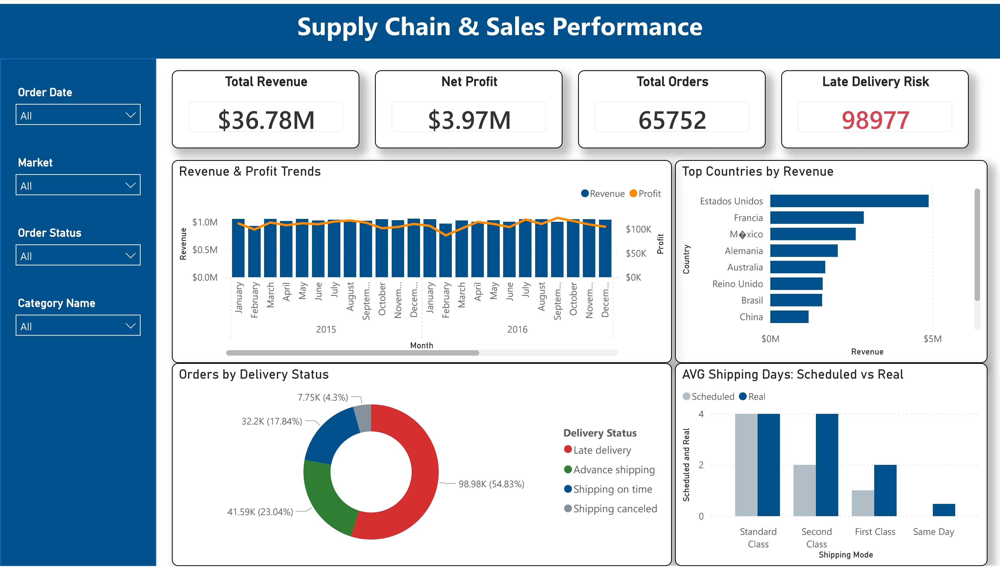

# 🚚 Logistics & Shipping Delivery Performance Dashboard

## 🎯 Project Objective
This project is an end-to-end performance tracking dashboard focusing on fulfillment logistics. It analyzes the pipeline comparing planned vs. actual shipping times, visualizes order status breakdown (Shipped, Canceled, Processing, On Hold), and geographical distribution to help mitigate operational risks and optimize the supply chain.

## 📸 Dashboard Snapshot

## 🛠️ Tools & Technologies Used
* **Data Visualization:** Microsoft Power BI
* **Data Preparation:** Power Query
* **Data Modeling:** DAX (Data Analysis Expressions)
* **Other Tools:** Supply Chain Analytics

## 💡 Key Insights & Business Value
1. **Profit Breakdown:** Net Profit ($3.97M) is significantly lower than Total Revenue ($36.7M), indicating high operating or shipping costs that need optimization.
2. **Operational Failure:** The core finding is a 55% late delivery rate (Shipping Failures chart). This is a critical risk factor needing immediate process improvement.
3. **Orders Breakdown:** Total orders: 21k. Standard Class is the dominant delivery mode. USA is the largest market.

## 🚀 How to Use This Repository
1. Download the `.pbix` file to interact with the dashboard in Power BI Desktop.
2. The raw dataset used for this analysis is available in the `DataCoSupplyChainDataset.csv` file.
